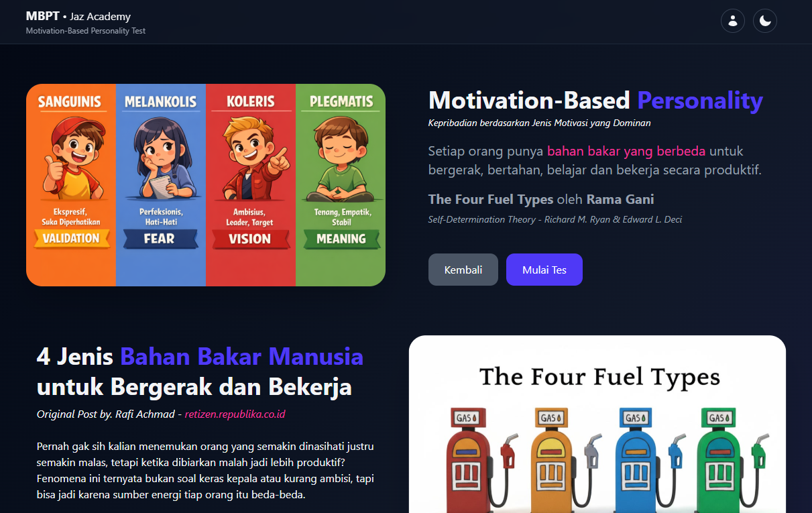

# MBPT Project

Motivation-Based Personality Test Application

## Overview

MBPT is a web-based personality assessment application designed to identify a user’s dominant motivation traits through a structured questionnaire and scoring system.

The application helps users understand what primarily drives their behavior, decisions, and work preferences.

## Key Features

- Motivation-based personality assessment
- Structured questionnaire
- Automated scoring & result analysis
- Clear personality result summary
- Responsive web interface

## Motivation Model

The test categorizes users based on dominant motivation dimensions, such as:

- Achievement-oriented
- Power-driven
- Affiliation-focused
- Security-oriented
  (_model can be extended or customized_)

## Tech Stack

- Frontend: HTML, CSS, Tailwind, JavaScript, React
- Backend: Node.js, Express
- Database: MongoDb
- Architecture: Serverless Vercel

## How It Works

1. User answers a series of motivation-based questions
2. Each answer contributes to specific motivation scores
3. System calculates dominant motivation
4. Result is displayed with explanation

## Screenshots / Demo

## Project Status

- Core logic: completed
- UI/UX: functional
- Future improvements:
  - Admin panel for question management
  - Result history
  - Export / report feature

## My Role

- Designed motivation scoring logic
- Built backend & database schema
- Implemented frontend integration
- End-to-end development

## Why This Project Matters

This project demonstrates:

- Logical thinking & algorithmic scoring
- Real-world form handling
- Data processing & result analysis
- Full-stack development capability

## License

Jaz Academy
